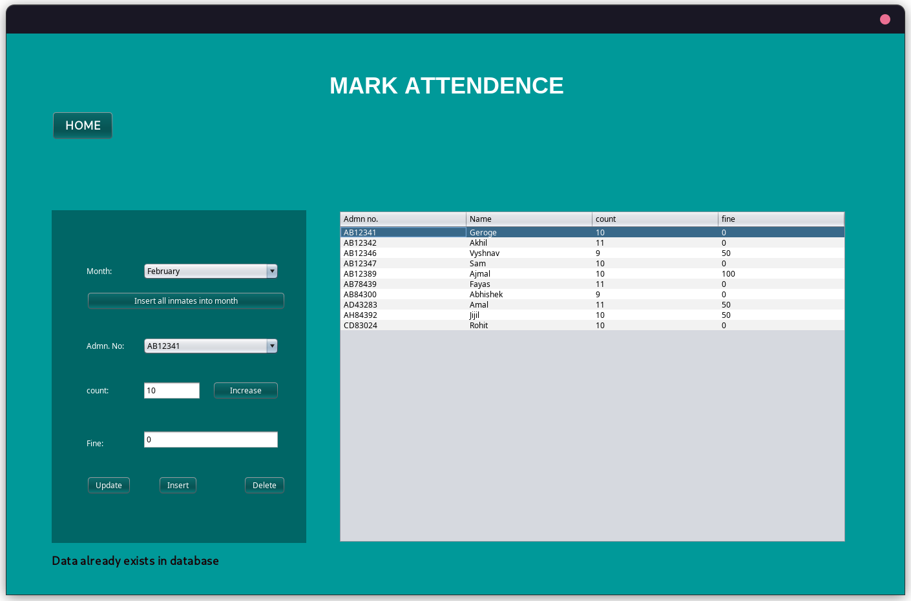

# hostel-management-system
This project was made as part of KTU Database Management Systems Lab - (CSL333)

---
## Dependencies
* [JDK 19](https://www.oracle.com/in/java/technologies/downloads/)  
* [Mysql](https://www.mysql.com/downloads/) 

## Installation
1. Download the sql files and jar file from [release](https://github.com/vskvj3/hostel-management-system/releases/tag/v1.0)

2. create the sql user and data base
```sql
source /path/to/initialize.sql
```
3. (optional) Create the dummy data
```sql
source /path/to/dump.sql
```
4. run the jar file
```bash
java -jar /path/to/jarfile.jar

```

## Screenshots





## Tools used :
* [MYSQL Community Server](https://www.mysql.com/)  
* [Apache Netbeans 16](https://netbeans.apache.org/)  
* [JDK 19](https://www.oracle.com/java/technologies/javase/jdk19-archive-downloads.html)  
* [Maven](https://maven.apache.org/) 
* [Mysql-Java Connectivity Driver](https://dev.mysql.com/downloads/connector/j/)  

